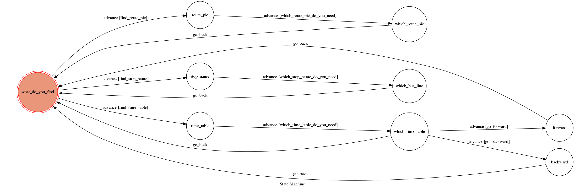

# TOC Project 2017

The program use the template Code from TA

A telegram bot based on a finite state machine

## Setup

### Prerequisite
* Python 3

#### Install Dependency
```sh
pip install -r requirements.txt
```

* pygraphviz (For visualizing Finite State Machine)
    * [Setup pygraphviz on Ubuntu](http://www.jianshu.com/p/a3da7ecc5303)


#### Run the sever

```sh
python3 app.py
```

## Finite State Machine


## Usage
The initial state is set to `what_do_you_find`.
The program is used to search the Tainan bus information.
There are 3 functions in this program.

*search the route picture:
    input the bus route , it will return a route picture for you.
    if you input the route name not exist, it will give you alert "查無此路線！請重新輸入：" .
*search time table
    input the bus route and go forward or backward , it will return a time table within 5 hours for you.
    if you input the route name not exist, it will give you alert "查無此路線！請重新輸入：".
    if there is no bus today , it will return you "末班駛離".
*list all bus stops of the bus route you want to know
    input the bus route , it will return all bus stops of the bus route you want to know.
    if you input the route name not exist, it will give you alert "查無此路線！請重新輸入：" .

* what_do_you_find
	* Input: any string include "路線圖"
		* Reply: "請輸入欲查詢的路線"
	* Input: any string include "時刻表"
		* Reply: "請輸入欲查詢的路線"
	* Input: any string include "站牌"
		* Reply: "請輸入欲查詢的路線"
*route_pic
	* Input: the bus route name. Ex:"綠幹線"
		* Reply: a route picture you need
*time_table
	* Input: the bus route name. Ex:"綠幹線"
		* Reply: "請輸入去程或返程"
*stop_name
	* Input: the bus route name. Ex:"綠幹線"
		* Reply: all stop names of the bus route
*which_time_table
	* Input: "去程" 
		* Reply: all forward bus time table within 5 hours
	* Input: "返程"
		* Reply: all backward bus time table within 5 hours
           


